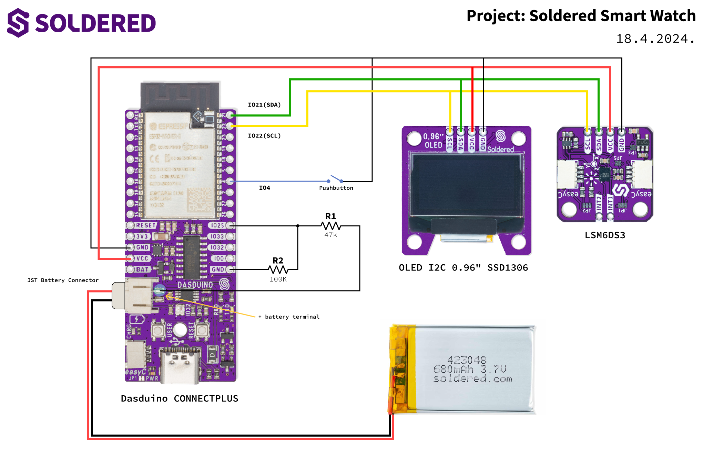
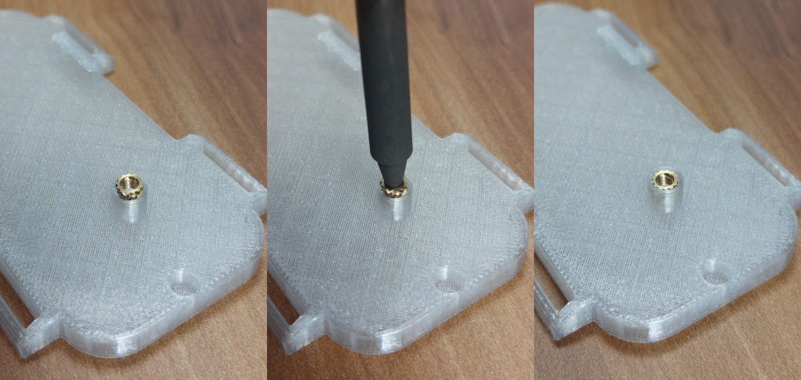
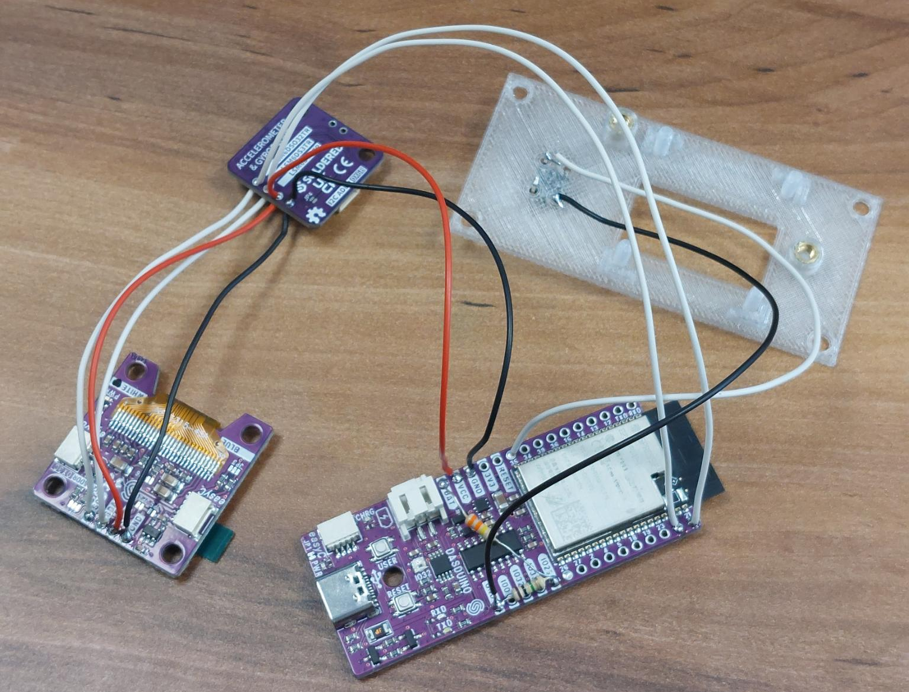
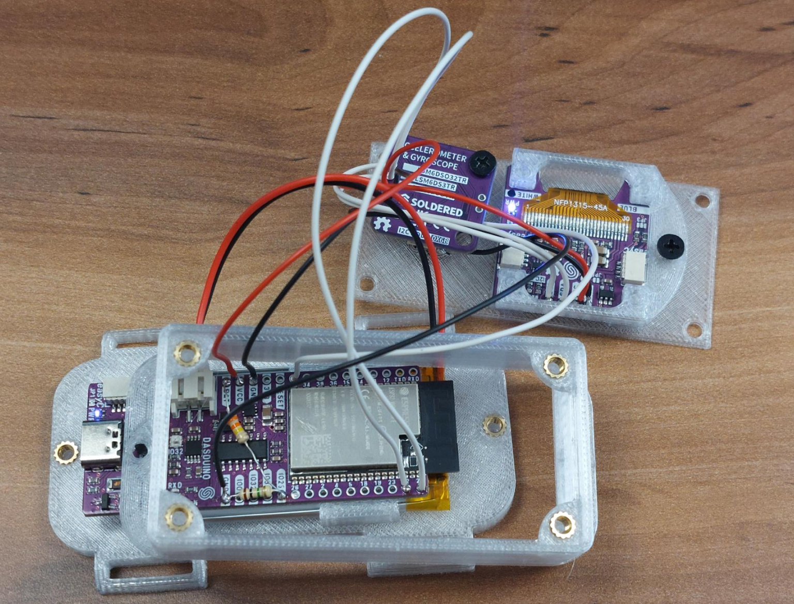
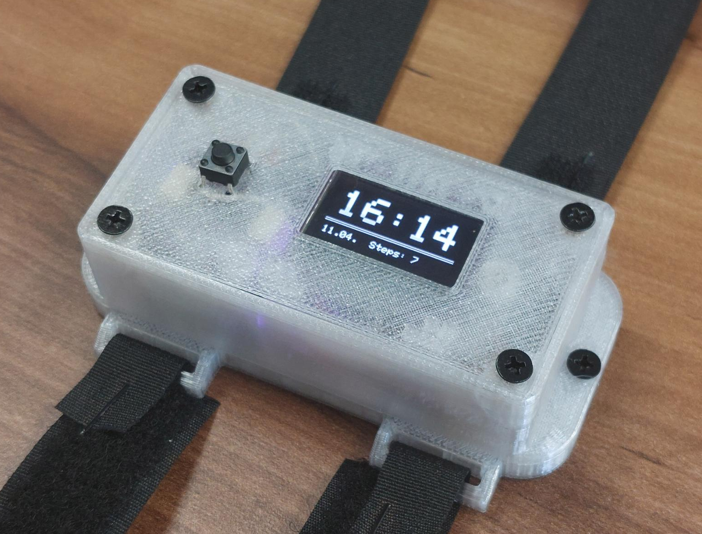
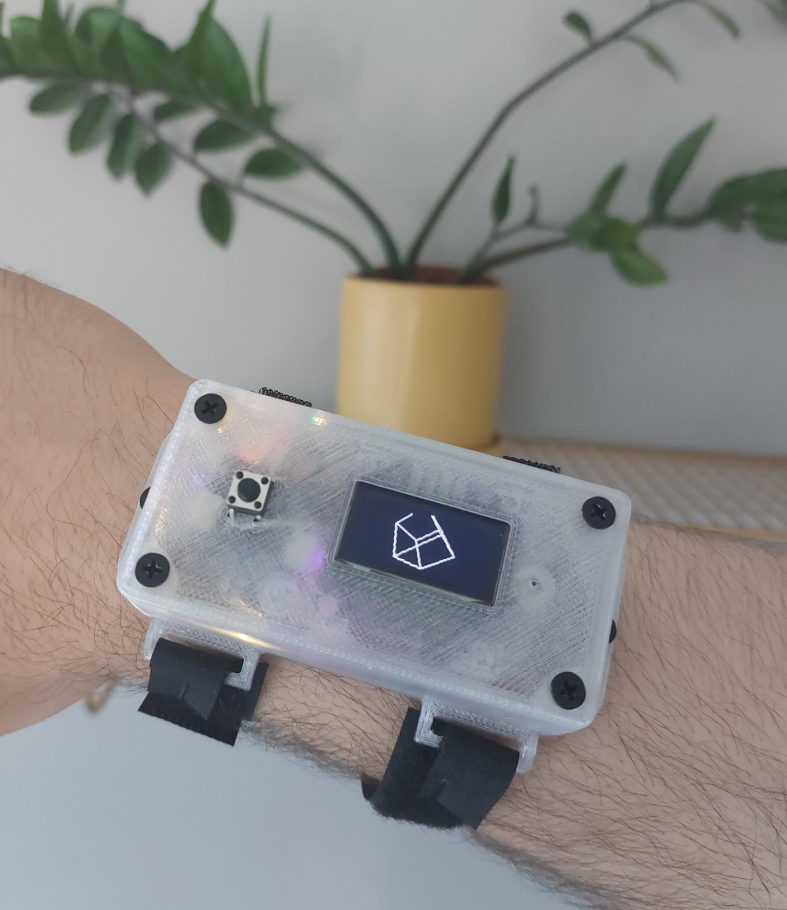

# Soldered Smart Watch Project

We can make our own weather stations, why not a smart watch? This project uses a Dasduino CONNECTPLUS, OLED Display and Gyroscope to create this wearable digital watch which also counts your daily steps.

Here's a detailed tutorial on how to make one:

## Required tools

If you're printing the case yourself, a 3D printer is required.
To assemble all the components, you will also need a soldering iron.

## Components and materials

Here's the list of components used for this project:

| **Komponenta**                   | **URL**                   |
|----------------------------------|---------------------------|
| Dasduino CONECTPLUS              | Solde.red/hr/333169       |
| OLED I2C 0.96" SSD1306           | Solde.red/hr/333099       |
| Akcelerometar i žiroskop LSM6DS3 | Solde.red/hr/333115       |
| Tipkalo                          | Solde.red/hr/101111       |
| Li-ion baterija 680mAh 3.7V      | Solde.red/hr/333280       |
| 9 x Vijak M3 6mm                 | Solde.red/hr/108941       |
| 9 x Navojni umetak M3 3mm        | Solde.red/hr/100761       |

You will also need a 47k Ohm and a 100k Ohm resistor and some wire.

## Compile and upload

To compile and upload the code, we reccomend using Arduino 1.8.x (legacy), which you can download [here](https://www.arduino.cc/en/software/OldSoftwareReleases/).

You will need to install the [Dasduino board definitions](https://github.com/SolderedElectronics/Dasduino-Board-Definitions-for-Arduino-IDE), as well.

The required libraries to compile the code are:
| **Library Name**                       | **URL**                                                                                     |
|----------------------------------------|---------------------------------------------------------------------------------------------|
| Soldered OLED Display Library          | [Link](https://github.com/SolderedElectronics/Soldered-OLED-Display-Arduino-Library)        |
| Soldered LSM6DS3 Library               | [Link](https://github.com/SolderedElectronics/Soldered-LSM6DS3-Arduino-Library)             |
| Soldered WS2812 Library                | [Link](https://github.com/SolderedElectronics/Soldered-WS2812-Smart-Leds-Arduino-Library)   |
| RBD Button                             | [Link](https://github.com/alextaujenis/RBD_Button)                                          |
| RBD Timer                              | [Link](https://github.com/alextaujenis/RBD_Timer)                                           |

You will also need to edit the src/defines.h file with your relevant WiFi data and any other settings you may want to change.

To upload the code, open Soldered-Smart-Watch.ino, connect the Dasduino to your computer, select Soldered Dasduino CONNECTPLUS as the board, select the correct COM port and upload!

## Schematic

## Assembly

1. First, install the thread inserts in the pre-made holes. This is done with a soldering iron. Heat your soldering iron to 300 degrees Celsius, then, simply place the thread insert on top of the hole and press it slightly straight down with the soldering iron. The heat from the soldering iron will also heat up the thread insert and slightly melt the plastic around it, allowing the thread insert to slide in and stay perfectly:

2. Solder all the components together according to the schematic. Check the photo below for the approximate wire length. It can even be a bit shorter than this:

3. Place the battery in the battery slot in the bottom of the case. Screw in the Dasduino. Also, attatch the OLED display to the front of the case with the OLED holder. Screw in the gyroscope as well. Finally, in this step, place the sides of the case through the top so it can be screwed in place:

4. Screw the sides in and the top of the case. Finally, you can attatch some type of velcro or watch straps on the side, of your choice. You're done!

